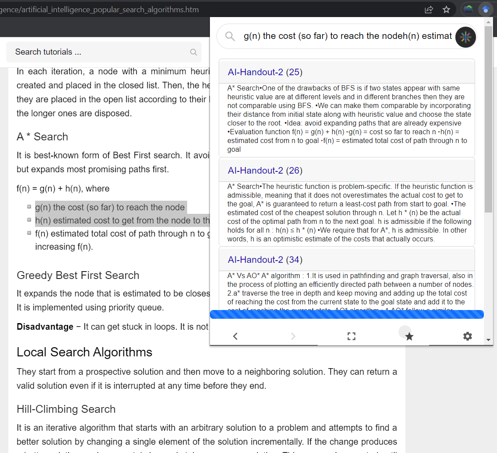
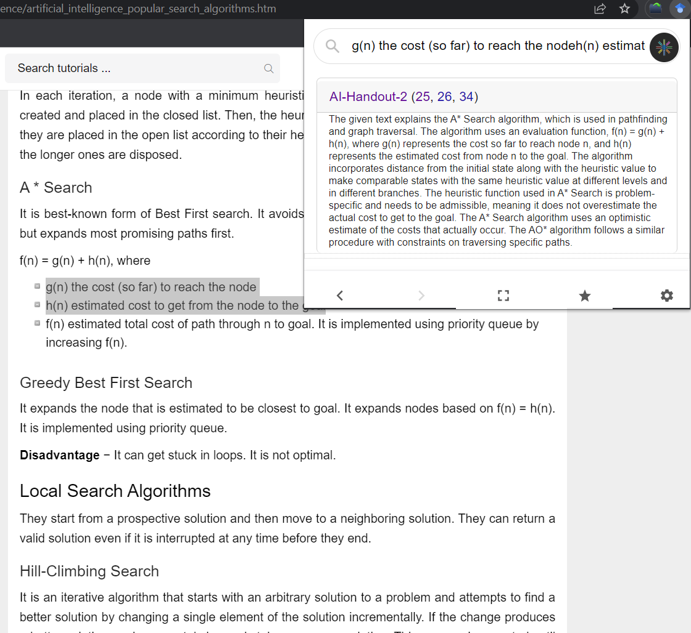
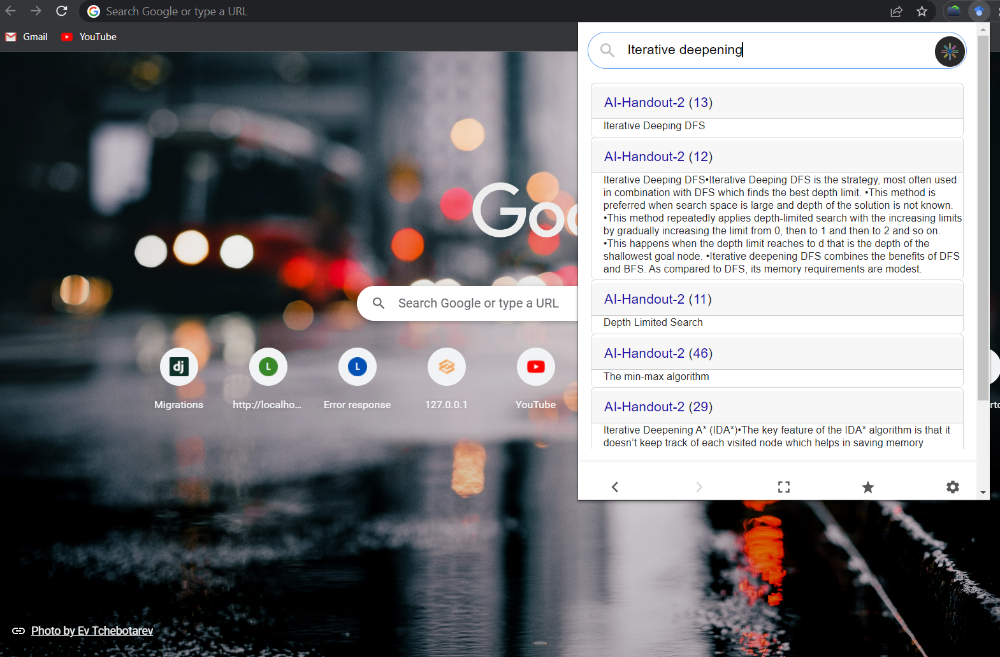

# Quick Ref

This Chrome Extension helps to find similar keywords and sentences from local pdfs. 
it uses NLP.
It also provides a summarised version of the results. 
It also provides a way to open the pdfs in browser or Adobe Reader or SumatraPDF.
It also opens pdf with given page no. and highlighted text.

So, this helps you to quickly find stuff from your local books/notes when you see similar info on web.
(I'm looking for contributors, please hmu if you want to contribute.)

## Setup
1. Clone the repo
2. Go to `chrome://extensions` and enable developer mode
3. Click on Load unpacked and select the `quick-ref` folder to load the extension
4. set openAI key in `api_key.py`  (optional)
5. install dependencies `pip install -r requirements.txt` (use venv in case of conflicts)
6. run `python main.py`
7. Add Path of Adobe Reader or SumatraPDF in `integrations.py` and set `READER_TO_USE` to 'Adobe' or 'Sumatra'
8. Add your pdfs in content folder, (or change `LIB_PATH` for different location)
9. Enjoy!

### Setup Using venv (Windows)
```bash
python -m venv venv
venv\\Scripts\\activate
pip install -r requirements.txt
python main.py
```

## Features
- Search terms, sentences from local pdfs
- Summarise the results
- Open PDFs in browser or Adobe Reader or SumatraPDF
- Opens pdf with given page no. and highlighted text

## Problems
OpenAI Embeds don't work for now. other LIB_PATH isn't tested.

## Features To Add
- [ ] Multiple Directory PDFs Support
- [ ] OpenAI Embeds
- [ ] Port to FireFox (Someone else will work on this)
- [ ] Support Normal Text Files/More Formats?

## Bug Fixes
- [ ] Skip Blank Pages from PDF
- [ ] Refactoring required (break main.py into api.py , nlp.py,config.py)

## Screenshots



