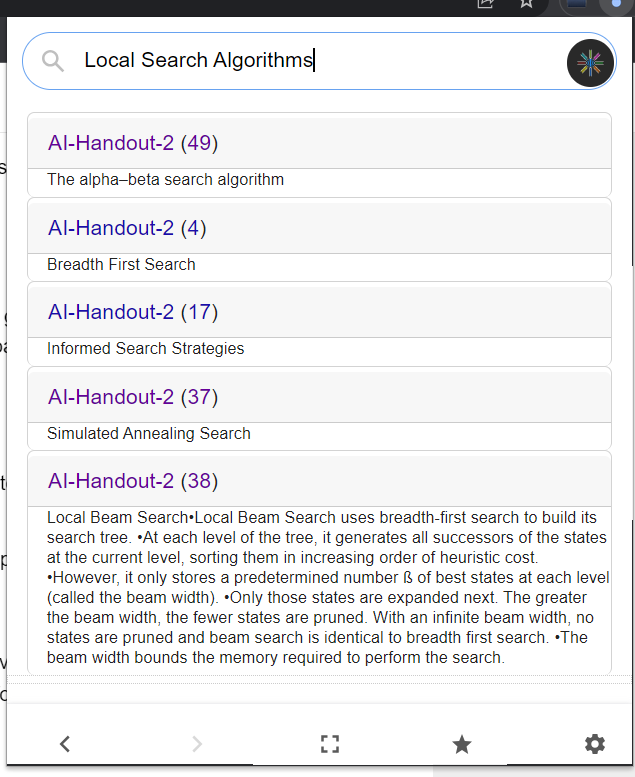

# Quick Ref

Chromme Extensions to get references quickly from your local files.
then you can open each page and summarise the results.

Star button is to summarise (same pdfs)

## Setup
1. Clone the repo
2. Go to `chrome://extensions` and enable developer mode
3. Click on Load unpacked and select the `quick-ref` folder to load the extension
4. set openAI key in `api_key.py`  (optional)
5. install dependencies `pip install -r requirements` (use venv in case of conflicts)
6. run `python main.py`
7. Add Path of Adobe Reader or SumatraPDF in `integrations.py` if you want to use them
8. Add your pdfs in content folder, (or change `LIB_PATH` for different location)
9. Enjoy!

## Features
- Search terms, sentences from local pdfs
- Summarise the results
- Open PDFs in browser or Adobe Reader or SumatraPDF
- Opens pdf with given page no and highlighted text

## Problems
OpenAI Embeds don't work for now. other LIB_PATH isn't tested.

## Features To Add
- [ ] Multiple Directory PDFs Support
- [ ] OpenAI Embeds

## Bug Fixes
- [ ] Use Blank Page instead

## Screenshots

